<picture><source media="(prefers-color-scheme: dark)" srcset="./assets/hero-dark.svg"></picture>

I'm a backend-first engineer who turns messy, manual workflows into software people rely on: crew-scheduling maths for an airline operations platform, a complete HR suite with role-based access and audit trails, and multi-agent pipelines that audit websites and review contracts. I've been building with AI since 2018 and do most of my work where **APIs, databases and language models meet**.

**Now:** turning Contrast into a product · building Jimmy, a modular personal AI assistant · going deeper on neural networks and system design.

[GitHub](https://github.com/Adhrit-Verma) &nbsp;·&nbsp; [Email](mailto:works.omen@gmail.com) &nbsp;·&nbsp; [Instagram](https://www.instagram.com/kafydier/) &nbsp;·&nbsp; [Buy me a coffee](https://www.buymeacoffee.com/kafydier)

<picture><source media="(prefers-color-scheme: dark)" srcset="./assets/section-production-dark.svg"></picture>

<picture><source media="(prefers-color-scheme: dark)" srcset="./assets/project-aviatrack-dark.svg"></picture>
<picture><source media="(prefers-color-scheme: dark)" srcset="./assets/project-hrm-dark.svg"></picture>

<picture><source media="(prefers-color-scheme: dark)" srcset="./assets/section-open-dark.svg"></picture>

<a href="https://github.com/Adhrit-Verma/Contrast"><picture><source media="(prefers-color-scheme: dark)" srcset="./assets/project-contrast-dark.svg"></picture></a>
<a href="https://github.com/Adhrit-Verma/ClauseGuard"><picture><source media="(prefers-color-scheme: dark)" srcset="./assets/project-clauseguard-dark.svg"></picture></a>
<a href="https://github.com/Adhrit-Verma/TableFox"><picture><source media="(prefers-color-scheme: dark)" srcset="./assets/project-tablefox-dark.svg"></picture></a>
<a href="https://github.com/Adhrit-Verma/two-agent-self-extending-ai-system"><picture><source media="(prefers-color-scheme: dark)" srcset="./assets/project-self-extending-ai-dark.svg"></picture></a>
<a href="https://github.com/Adhrit-Verma/GDC"><picture><source media="(prefers-color-scheme: dark)" srcset="./assets/project-gdc-dark.svg"></picture></a>
<a href="https://github.com/Adhrit-Verma/AuDix_User"><picture><source media="(prefers-color-scheme: dark)" srcset="./assets/project-audix-dark.svg"></picture></a>

Also on my profile: <a href="https://github.com/Adhrit-Verma/LocalDocQA">LocalDocQA</a> · <a href="https://github.com/Adhrit-Verma/pc_emo-v1">PC Emo</a> · <a href="https://github.com/Adhrit-Verma/Stock-Price-Checker">Stock Price Checker</a> · <a href="https://github.com/Adhrit-Verma/3D-Cube-Project">3D Cube</a>

<picture><source media="(prefers-color-scheme: dark)" srcset="./assets/section-method-dark.svg"></picture>

<picture><source media="(prefers-color-scheme: dark)" srcset="./assets/method-dark.svg"></picture>

<picture><source media="(prefers-color-scheme: dark)" srcset="./assets/section-toolkit-dark.svg"></picture>

<picture><source media="(prefers-color-scheme: dark)" srcset="./assets/toolkit-dark.svg"></picture>

<picture><source media="(prefers-color-scheme: dark)" srcset="./assets/section-activity-dark.svg"></picture>

<picture><source media="(prefers-color-scheme: dark)" srcset="./assets/activity-dark.svg"></picture>

<picture><source media="(prefers-color-scheme: dark)" srcset="./assets/colophon-dark.svg"></picture>

How this page is made

Every image above is an animated SVG rendered by <a href="./scripts/generate.mjs"><code>scripts/generate.mjs</code></a> in both GitHub themes, using GitHub’s own open-source design stack: colour tokens from <a href="https://github.com/primer/primitives">primer/primitives</a>, icons from <a href="https://github.com/primer/octicons">primer/octicons</a> and <a href="https://github.com/simple-icons/simple-icons">simple-icons</a>, and the typefaces <a href="https://github.com/github/mona-sans">Mona Sans</a>, <a href="https://github.com/github/hubot-sans">Hubot Sans</a> and <a href="https://github.com/githubnext/monaspace">Monaspace</a> (SIL OFL), subset and embedded per image. The topographic header is generated from seeded Perlin noise; the activity ridgelines are drawn from real contribution data by a <a href="./.github/workflows/profile.yml">GitHub Action</a> twice a day. All motion respects <code>prefers-reduced-motion</code>.

