


 


I'm a backend-first engineer who turns **messy, manual workflows into software people actually use**: crew-scheduling maths for an airline ops platform, a full HR suite with RBAC and audit trails, and multi-agent AI pipelines that audit websites and review contracts. I've been messing with AI since class 11 (2018), and these days I spend most of my time where **APIs, databases and LLMs meet**.


## ⚡ Featured builds

<table>
<tr>
<td width="50%"><a href="https://github.com/Adhrit-Verma/Contrast"></a></td>
<td width="50%"><a href="https://github.com/Adhrit-Verma/ClauseGuard"></a></td>
</tr>
<tr>
<td width="50%"><a href="https://github.com/Adhrit-Verma/TableFox"></a></td>
<td width="50%"><a href="https://github.com/Adhrit-Verma/two-agent-self-extending-ai-system"></a></td>
</tr>
<tr>
<td width="50%"><a href="https://github.com/Adhrit-Verma/GDC"></a></td>
<td width="50%"><a href="https://github.com/Adhrit-Verma/AuDix_User"></a></td>
</tr>
</table>

### 🏭 In production (closed-source)

<table>
<tr>
<td width="50%"></td>
<td width="50%"></td>
</tr>
</table>

More on my profile: <a href="https://github.com/Adhrit-Verma/LocalDocQA">LocalDocQA</a> · <a href="https://github.com/Adhrit-Verma/pc_emo-v1">PC Emo</a> · <a href="https://github.com/Adhrit-Verma/Stock-Price-Checker">Stock Price Checker</a> · <a href="https://github.com/Adhrit-Verma/3D-Cube-Project">3D Cube</a>

## 🌳 Skill tree


  

## 🎮 Quest log


## 📊 Live stats


  
    
  

<b>🛠️ How this README is built (it's a project too)</b>

 

GitHub strips JavaScript from READMEs, so every animation here is an **SVG generated by JavaScript**:

- [`scripts/generate.mjs`](./scripts/generate.mjs) is a zero-dependency Node script that renders the hero, terminal, pipeline, project cards, skill tree, quest log and stats as animated SVGs (CSS keyframes and SMIL).
- A [GitHub Action](./.github/workflows/profile.yml) runs it every 12 hours, pulls live repo and language data from the GitHub API, commits fresh SVGs and redraws the contribution snake.
- Every SVG has a `<title>` for screen readers and respects `prefers-reduced-motion`, because I build accessibility tooling and it would be embarrassing otherwise.

 

**“I don’t just collect tech stacks — I build things until they work.”**

